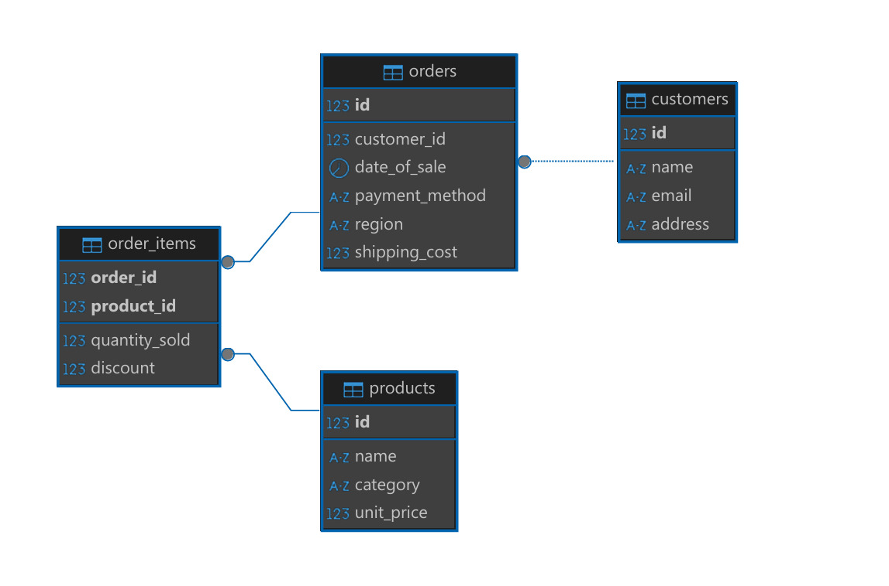

# SalesMonitoring

## Setup Instructions

## Database Schema



### Database Setup
Please create all functions provided in the `db_script` directory.

### CSV Loader
**Software Requirement:** Python 3.8 or Above (I'm using 3.12)

1. Install dependencies:
   ```sh
   pip install -r req.txt
   ```
2. Run manually:
   ```sh
   python3 csv_up.py
   ```
3. Run automatically every 5 minutes:
   ```sh
   python3 data_refresh_scheduler.py
   ```
   - Refresh logs are stored in `data_refresh_log.log`

### API Server
The web server API is built using Rust.

**Software Requirement:** [Install Rust](https://www.rust-lang.org/tools/install)

Configuration settings are in `database_config.json`:
```json
{
    "db_host": "localhost",
    "db_port": 5432,
    "db_name": "db_name",
    "db_user_name": "db_user",
    "db_password": "db_password",
    "api_port": 8100,
    "toggle_log": 1,
    "log_file_path": "C:/api_log/",
    "error_log": 0,
    "io_log": 0
}
```
- **Enable Environment Log:** Set `toggle_log` to `1`.
- **Enable File Log:** Set `toggle_log` to `0`.
- **Error Logging:** Set `error_log` to `1` to disable error logs.
- **I/O Logging:** Set `io_log` to `1` to disable input/output logs.

**Run the Rust API:**
```sh
cargo run
```

## API Endpoints
| Endpoint | Method | Body | Sample Response | Description |
|----------|--------|------|----------------|-------------|
| `/v1/total_revenue/` | POST | `{ "start_date":"2023-12-01", "end_date":"2024-12-31" }` | `{ "total_revenue": 4712.5675 }` | Returns total revenue. |
| `/v1/total_customers/` | POST | `{ "start_date":"2023-12-01", "end_date":"2024-12-31" }` | `{ "total_customers": 3 }` | Returns total customers. |
| `/v1/total_orders/` | POST | `{ "start_date":"2023-12-01", "end_date":"2024-12-31" }` | `{ "total_orders": 6 }` | Returns total orders. |
| `/v1/average_order_value/` | POST | `{ "start_date":"2023-12-01", "end_date":"2024-12-31" }` | `{ "average_order_value": 785.4279166666666 }` | Returns average order value. |
| `/v1/total_revenue_by_product/` | POST | `{ "start_date":"2023-12-01", "end_date":"2024-12-31" }` | `{ "by_products": [{"product_name": "iPhone 15 Pro", "total_revenue": 3767.1}, {"product_name": "Levi's 501 Jeans", "total_revenue": 143.976}, {"product_name": "Sony WH-1000XM5 Headphones", "total_revenue": 297.4915}, {"product_name": "UltraBoost Running Shoes", "total_revenue": 504.0}]}` | Returns total revenue by product. |
| `/v1/total_revenue_by_category/` | POST | `{ "start_date":"2023-12-01", "end_date":"2024-12-31" }` | `{ "by_category": [{"category": "Clothing", "total_revenue": 143.976}, {"category": "Electronics", "total_revenue": 4064.5915}, {"category": "Shoes", "total_revenue": 504.0}]}` | Returns total revenue by category. |
| `/v1/total_revenue_by_region/` | POST | `{ "start_date":"2023-12-01", "end_date":"2024-12-31" }` | `{ "by_region": [{"region": "Asia", "total_revenue": 2612.076}, {"region": "Europe", "total_revenue": 1299.0}, {"region": "North America", "total_revenue": 621.4915}, {"region": "South America", "total_revenue": 180.0}]}` | Returns total revenue by region. |
| `/v1/customer_lifetime_value/` | POST | `{ "start_date":"2023-12-01", "end_date":"2024-12-31" }` | `{ "customer_lifetime_value": [{"customer_name": "Emily Davis", "lifetime_value": 1596.4915}, {"customer_name": "John Smith", "lifetime_value": 467.976}, {"customer_name": "Sarah Johnson", "lifetime_value": 2648.1}]}` | Returns customer lifetime value. |
| `/v1/top_n_products_overall/` | POST | `{ "numbers":3, "start_date":"2023-12-01", "end_date":"2024-12-31" }` | `{ "overall": [{"product_name": "iPhone 15 Pro", "total_quantity_sold": 3}, {"product_name": "Levi's 501 Jeans", "total_quantity_sold": 3}, {"product_name": "UltraBoost Running Shoes", "total_quantity_sold": 3}]}` | Returns top N products overall. |
| `/v1/top_n_products_by_category/` | POST | `{ "numbers":2, "filterby":"Electronics", "start_date":"2023-12-01", "end_date":"2024-12-31" }` | `{ "by_category": [{"product_name": "iPhone 15 Pro", "total_quantity_sold": 3}, {"product_name": "Sony WH-1000XM5 Headphones", "total_quantity_sold": 1}]}` | Returns top N products by category. |
| `/v1/top_n_products_by_region/` | POST | `{ "numbers":2, "filterby":"North America", "start_date":"2023-12-01", "end_date":"2024-12-31" }` | `{ "by_region": [{"product_name": "UltraBoost Running Shoes", "total_quantity_sold": 2}, {"product_name": "Sony WH-1000XM5 Headphones", "total_quantity_sold": 1}]}` | Returns top N products by region. |

### Postman Collection
The Postman collection is available in the `postman_collection` directory.


**Ensure all dependencies are installed and configurations are properly set before running the system.**

